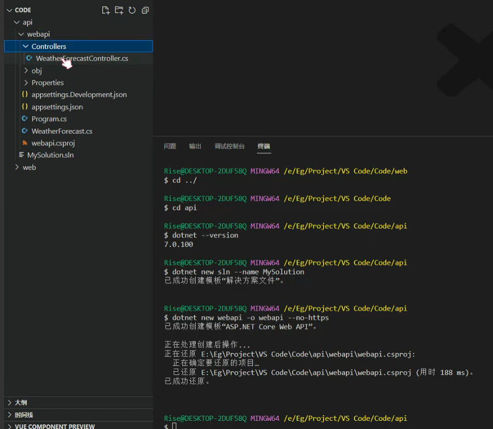
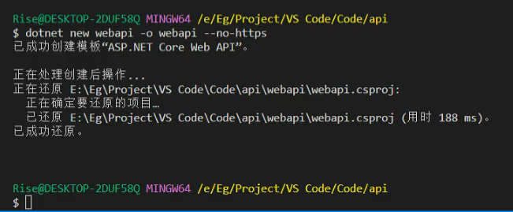
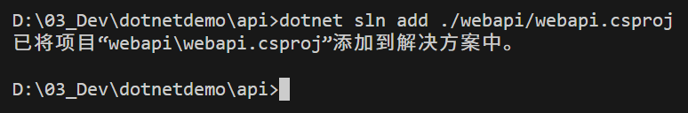
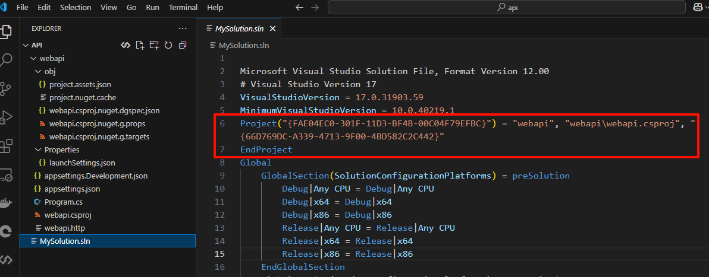
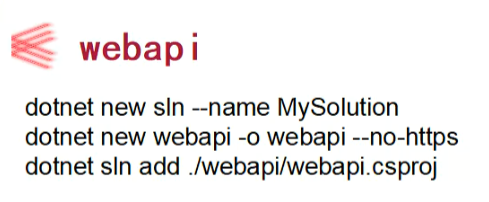
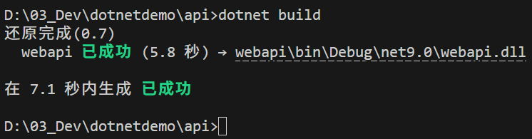
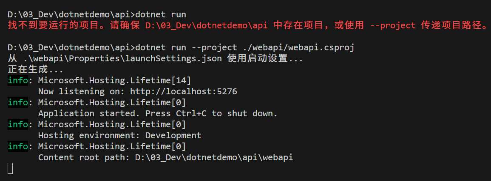
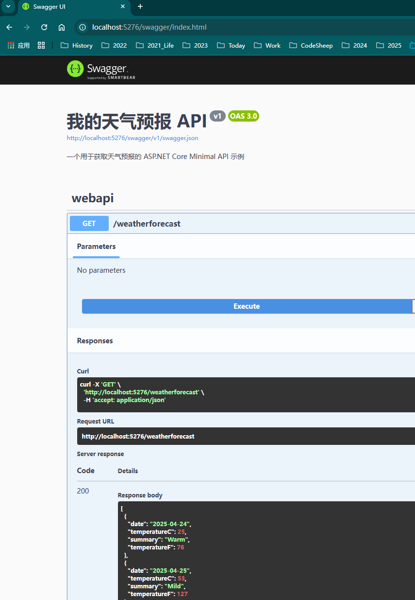

# dotnet-demo
VS Code Run C# Solution - 用 VS Code 创建解决方案，新增项目并打包、编译项目（含Swagger）


### 查看DOTNET版本

> D:\03_Dev\dotnetdemo>dotnet --version
>
> 9.0.203

### 创建解决方案

> dotnet new sln --name MySolution



### 新建模块

> dotnet new webapi -o webapi --no-https 

 

### 绑定项目的解决方案中

> D:\03_Dev\dotnetdemo\api>dotnet sln add ./webapi/webapi.csproj 
>
> 已将项目“webapi\webapi.csproj”添加到解决方案中。



项目信息绑定成功：



### 三个命令

> 创建解决方案
> dotnet new sln --name MySolution
>
> 创建项目
> dotnet new webapi -o webapi --no-https 
>
> 绑定项目到解决方案
> dotnet sln add ./webapi/webapi.csproj 

 

### 编译解决方案

> dotnet build

 

### 启动项目（带project参数）

> D:\03_Dev\dotnetdemo\api>dotnet run
>
> 找不到要运行的项目。请确保 D:\03_Dev\dotnetdemo\api 中存在项目，或使用 --project 传递项目路径。      
>
> 
>
> D:\03_Dev\dotnetdemo\api>dotnet run --project ./webapi/webapi.csproj
>
> 从 .\webapi\Properties\launchSettings.json 使用启动设置...
>
> 正在生成...
>
> info: Microsoft.Hosting.Lifetime[14]
>
> ​      Now listening on: http://localhost:5276
>
> info: Microsoft.Hosting.Lifetime[0]
>
> ​      Application started. Press Ctrl+C to shut down.
>
> info: Microsoft.Hosting.Lifetime[0]
>
> ​      Hosting environment: Development
>
> info: Microsoft.Hosting.Lifetime[0]
>
> ​      Content root path: D:\03_Dev\dotnetdemo\api\webapi



### 增加Swagger

#### 增加包

> D:\03_Dev\dotnetdemo\api>cd webapi
>
> 
>
> D:\03_Dev\dotnetdemo\api\webapi>dotnet add package Swashbuckle.AspNetCore
>
> 
>
> 在 0.8 秒内生成 已成功
>
> info : X.509 证书链验证将使用 .NET 选择的默认信任存储进行代码签名。
>
> info : X.509 证书链验证将使用 .NET 选择的默认信任存储进行时间戳。
>
> info : 正在将包“Swashbuckle.AspNetCore”的 PackageReference 添加到项目“D:\03_Dev\dotnetdemo\api\webapi\webapi.csproj”。
>
> info :   GET https://api.nuget.org/v3/registration5-gz-semver2/swashbuckle.aspnetcore/index.json
>
> info :   OK https://api.nuget.org/v3/registration5-gz-semver2/swashbuckle.aspnetcore/index.json 781 
>
> 毫秒
>
> info : 正在还原 D:\03_Dev\dotnetdemo\api\webapi\webapi.csproj 的包...
>
> info :   GET https://api.nuget.org/v3-flatcontainer/swashbuckle.aspnetcore/index.json
>
> info :   OK https://api.nuget.org/v3-flatcontainer/swashbuckle.aspnetcore/index.json 630 毫秒
>
> info :   GET https://api.nuget.org/v3-flatcontainer/swashbuckle.aspnetcore/8.1.1/swashbuckle.aspnetcore.8.1.1.nupkg
>
> info :   OK https://api.nuget.org/v3-flatcontainer/swashbuckle.aspnetcore/8.1.1/swashbuckle.aspnetcore.8.1.1.nupkg 155 毫秒
>
> info :   GET https://api.nuget.org/v3-flatcontainer/swashbuckle.aspnetcore.swagger/index.json
>
> info :   GET https://api.nuget.org/v3-flatcontainer/swashbuckle.aspnetcore.swaggergen/index.json     
>
> info :   GET https://api.nuget.org/v3-flatcontainer/swashbuckle.aspnetcore.swaggerui/index.json      
>
> info :   OK https://api.nuget.org/v3-flatcontainer/swashbuckle.aspnetcore.swagger/index.json 274 毫秒
>
> info :   GET https://api.nuget.org/v3-flatcontainer/swashbuckle.aspnetcore.swagger/8.1.1/swashbuckle.aspnetcore.swagger.8.1.1.nupkg
>
> info :   OK https://api.nuget.org/v3-flatcontainer/swashbuckle.aspnetcore.swaggergen/index.json 432 
>
> 毫秒
>
> info :   GET https://api.nuget.org/v3-flatcontainer/swashbuckle.aspnetcore.swaggergen/8.1.1/swashbuckle.aspnetcore.swaggergen.8.1.1.nupkg
>
> info :   OK https://api.nuget.org/v3-flatcontainer/swashbuckle.aspnetcore.swaggerui/index.json 441 毫秒
>
> info :   GET https://api.nuget.org/v3-flatcontainer/swashbuckle.aspnetcore.swaggerui/8.1.1/swashbuckle.aspnetcore.swaggerui.8.1.1.nupkg
>
> info :   OK https://api.nuget.org/v3-flatcontainer/swashbuckle.aspnetcore.swagger/8.1.1/swashbuckle.aspnetcore.swagger.8.1.1.nupkg 242 毫秒
>
> info :   GET https://api.nuget.org/v3-flatcontainer/microsoft.openapi/index.json
>
> info :   OK https://api.nuget.org/v3-flatcontainer/swashbuckle.aspnetcore.swaggergen/8.1.1/swashbuckle.aspnetcore.swaggergen.8.1.1.nupkg 150 毫秒
>
> info :   OK https://api.nuget.org/v3-flatcontainer/swashbuckle.aspnetcore.swaggerui/8.1.1/swashbuckle.aspnetcore.swaggerui.8.1.1.nupkg 147 毫秒
>
> info :   OK https://api.nuget.org/v3-flatcontainer/microsoft.openapi/index.json 191 毫秒
>
> info :   GET https://api.nuget.org/v3-flatcontainer/microsoft.openapi/1.6.23/microsoft.openapi.1.6.23.nupkg
>
> info :   OK https://api.nuget.org/v3-flatcontainer/microsoft.openapi/1.6.23/microsoft.openapi.1.6.23.nupkg 149 毫秒
>
> info : 已使用内容哈希 HJHexmU0PiYevgTLvKjYkxEtclF2w4O7iTd3Ef3p6KeT0kcYLpkFVgCw6glpGS57h8769anv8G+NFi9Kge+/yw== 从 https://api.nuget.org/v3/index.json 到 C:\Users\CoderDream\.nuget\packages\swashbuckle.aspnetcore\8.1.1 安装 Swashbuckle.AspNetCore 8.1.1。
>
> info : 已使用内容哈希 tZ1I0KXnn98CWuV8cpI247A17jaY+ILS9vvF7yhI0uPPEqF4P1d7BWL5Uwtel10w9NucllHB3nTkfYTAcHAh8g== 从 https://api.nuget.org/v3/index.json 到 C:\Users\CoderDream\.nuget\packages\microsoft.openapi\1.6.23 安装 Microsoft.OpenApi 1.6.23。
>
> info : 已使用内容哈希 h+8D5jQtnl6X4f2hJQwf0Khj0SnCQANzirCELjXJ6quJ4C1aNNCvJrAsQ+4fOKAMqJkvW48cKj79ftG+YoGcRg== 从 https://api.nuget.org/v3/index.json 到 C:\Users\CoderDream\.nuget\packages\swashbuckle.aspnetcore.swagger\8.1.1 安装 Swashbuckle.AspNetCore.Swagger 8.1.1。
>
> info : 已使用内容哈希 2EuPzXSNleOOzYvziERWRLnk1Oz9i0Z1PimaUFy1SasBqeV/rG+eMfwFAMtTaf4W6gvVOzRcUCNRHvpBIIzr+A== 从 https://api.nuget.org/v3/index.json 到 C:\Users\CoderDream\.nuget\packages\swashbuckle.aspnetcore.swaggergen\8.1.1 安装 Swashbuckle.AspNetCore.SwaggerGen 8.1.1。
>
> info : 已使用内容哈希 GDLX/MpK4oa2nYC1N/zN2UidQTtVKLPF6gkdEmGb0RITEwpJG9Gu8olKqPYnKqVeFn44JZoCS0M2LGRKXP8B/A== 从 https://api.nuget.org/v3/index.json 到 C:\Users\CoderDream\.nuget\packages\swashbuckle.aspnetcore.swaggerui\8.1.1 安装 Swashbuckle.AspNetCore.SwaggerUI 8.1.1。
>
> info :   GET https://api.nuget.org/v3/vulnerabilities/index.json
>
> info :   OK https://api.nuget.org/v3/vulnerabilities/index.json 188 毫秒
>
> info :   GET https://api.nuget.org/v3/vulnerabilities/vulnerability.base.json
>
> info :   GET https://api.nuget.org/v3/vulnerabilities/vulnerability.update.json
>
> info :   OK https://api.nuget.org/v3/vulnerabilities/vulnerability.base.json 188 毫秒
>
> info :   OK https://api.nuget.org/v3/vulnerabilities/vulnerability.update.json 188 毫秒
>
> info : 包“Swashbuckle.AspNetCore”与项目“D:\03_Dev\dotnetdemo\api\webapi\webapi.csproj”中指定的所有框
>
> 架均兼容。
>
> info : 包“Swashbuckle.AspNetCore”(版本为 8.1.1)的 PackageReference 已添加到文件“D:\03_Dev\dotnetdemo\api\webapi\webapi.csproj”。
>
> info : 正在生成 MSBuild 文件 D:\03_Dev\dotnetdemo\api\webapi\obj\webapi.csproj.nuget.g.props。       
>
> info : 正在生成 MSBuild 文件 D:\03_Dev\dotnetdemo\api\webapi\obj\webapi.csproj.nuget.g.targets。     
>
> info : 将资产文件写入磁盘。路径: D:\03_Dev\dotnetdemo\api\webapi\obj\project.assets.json
>
> log  : 已还原 D:\03_Dev\dotnetdemo\api\webapi\webapi.csproj (用时 2.7 秒)。
>
> 
>
> D:\03_Dev\dotnetdemo\api\webapi>

#### 修改文件

```csharp
var builder = WebApplication.CreateBuilder(args);

// Add services to the container.
// Learn more about configuring OpenAPI at https://aka.ms/aspnet/openapi
// builder.Services.AddOpenApi();

// Add services to the container.

// **添加这行：用于 API 探测器，帮助 Swagger 发现 Minimal API 端点**
builder.Services.AddEndpointsApiExplorer();

// **添加这行：注册 Swagger 生成器服务**
// 你可以保留或删除 AddOpenApi()，AddSwaggerGen() 是 Swashbuckle 的核心配置方法
// builder.Services.AddOpenApi(); // 这行可以删除或保留，AddSwaggerGen 包含其功能
// builder.Services.AddSwaggerGen(); // 如果需要定制，可以在这里配置，例如：
builder.Services.AddSwaggerGen(options =>
{
    options.SwaggerDoc("v1", new Microsoft.OpenApi.Models.OpenApiInfo
    {
        Version = "v1",
        Title = "我的天气预报 API",
        Description = "一个用于获取天气预报的 ASP.NET Core Minimal API 示例"
    });
});

var app = builder.Build();

// Configure the HTTP request pipeline.
if (app.Environment.IsDevelopment())
{
    // **添加这行：启用 Swagger 中间件，用于生成 Swagger JSON 端点**
    app.UseSwagger();

    // **添加这行：启用 Swagger UI 中间件**
    app.UseSwaggerUI(); // 默认访问路径是 /swagger

    // 你原有的 MapOpenApi() 可以删除，因为 UseSwagger() 和 UseSwaggerUI() 提供了更完整的功能
    // app.MapOpenApi();
}

var summaries = new[]
{
    "Freezing", "Bracing", "Chilly", "Cool", "Mild", "Warm", "Balmy", "Hot", "Sweltering", "Scorching"
};

app.MapGet("/weatherforecast", () =>
{
    var forecast =  Enumerable.Range(1, 5).Select(index =>
        new WeatherForecast
        (
            DateOnly.FromDateTime(DateTime.Now.AddDays(index)),
            Random.Shared.Next(-20, 55),
            summaries[Random.Shared.Next(summaries.Length)]
        ))
        .ToArray();
    return forecast;
})
.WithName("GetWeatherForecast");

app.Run();

record WeatherForecast(DateOnly Date, int TemperatureC, string? Summary)
{
    public int TemperatureF => 32 + (int)(TemperatureC / 0.5556);
}
```

### 编译运行

> D:\03_Dev\dotnetdemo\api\webapi>cd ..
>
> 
>
> D:\03_Dev\dotnetdemo\api>dotnet build
>
> 还原完成(0.8)
>
>   webapi 已成功 (4.1 秒) → webapi\bin\Debug\net9.0\webapi.dll
>
> 
>
> 在 5.3 秒内生成 已成功
>
> 
>
> D:\03_Dev\dotnetdemo\api>dotnet run --project ./webapi/webapi.csproj
>
> 从 .\webapi\Properties\launchSettings.json 使用启动设置...
>
> 正在生成...
>
> info: Microsoft.Hosting.Lifetime[14]
>
> ​      Now listening on: http://localhost:5276
>
> info: Microsoft.Hosting.Lifetime[0]
>
> ​      Application started. Press Ctrl+C to shut down.
>
> info: Microsoft.Hosting.Lifetime[0]
>
> ​      Hosting environment: Development
>
> info: Microsoft.Hosting.Lifetime[0]
>
> ​      Content root path: D:\03_Dev\dotnetdemo\api\webapi

### 验证效果

http://localhost:5276/swagger/index.html




### 参考视频

[宇宙级VS Code零基础教程 全网最全最细的VS Code，开发前端、C#(.NET Core/.NET6/Vue)S0044_哔哩哔哩_bilibili](https://www.bilibili.com/video/BV1DUoKYXEUr)
